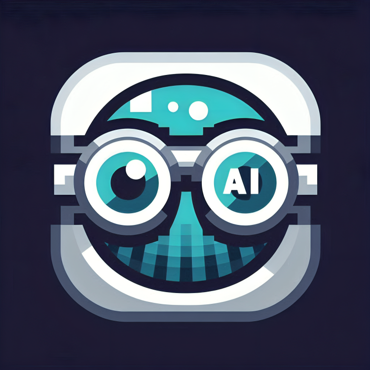

#  BlindViz

**Empowering Independence for the Visually Impaired**

BlindViz is an AI-powered mobile application that enhances the independence and mobility of visually impaired individuals. It integrates advanced AI technologies for object detection, text recognition, and natural language understanding to provide real-time assistance.

---

## 🚀 Features

- **Voice Command Interface**: Effortless interaction using natural language.
- **Real-Time Object Detection**: Recognize objects in your surroundings accurately.
- **Optical Character Recognition (OCR)**: Extract and read text from images or documents.
- **AI-Powered Scene Analysis**: Leverage LLMs for context-aware assistance.
- **Auditory Feedback**: Deliver actionable insights via voice output.

---

## 🛠️ Technologies Used

- **Mobile Frontend**: Flutter for cross-platform app development.
- **Computer Vision**: YOLO and OCR models for object and text recognition.
- **Natural Language Processing**: LLM-powered APIs for conversational interaction.
- **Backend APIs**: FastAPI for seamless API integration.
- **Speech Processing**: Google Speech API for audio feedback.

---

## 📂 Directory Structure

```plaintext
BlindViz/
├── flutter_app/           # Mobile application built with Flutter
├── llm_api/               # Backend for LLM-powered interactions
│   ├── app.py             # FastAPI application for LLM APIs
│   └── requirements.txt   # Dependencies for LLM API
├── vision_api/            # Backend for computer vision tasks
│   ├── text_ocr.py        # OCR script for text recognition
│   └── requirements.txt   # Dependencies for vision API
├── icon.png               # Project icon
└── readme.md              # Project documentation
